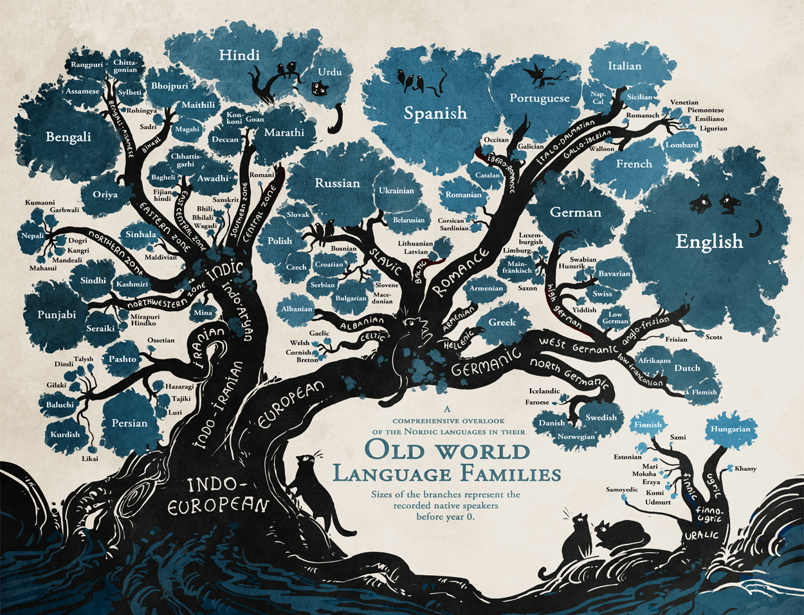

import Ling from './ling'

One of my new year's resolutions this year was to learn a language

li

I took two linguistics classes late, styntax and semantics

even with

[US State Department](https://2009-2017.state.gov/m/fsi/sls/orgoverview/languages/index.htm)

Comparative linguistics is the study of lanaguge similarity in
order to establish historical relationships between languages.

Romance languages  come from Latin  **Germanic** langugaes

[Damashek](http://citeseerx.ist.psu.edu/viewdoc/download?doi=10.1.1.159.7010&rep=rep1&type=pdf)

**bold**

language

historical lingusitics

The final

lexicostatsitcsi

<Ling />

similarity matrix

hello

Force Directed Graphs

treat so what do we do yada

### Limitations
All the languages measured this far use the

Malay, Kazahstan [^1]

[^1]: https://www.youtube.com/watch?v=hZ310om9JCY
