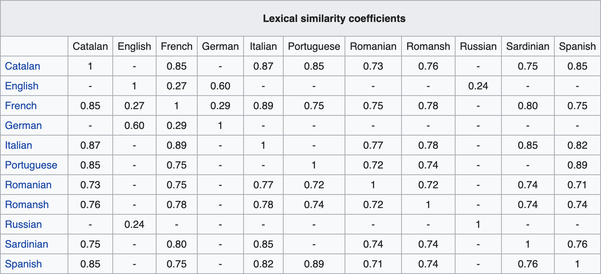

import Ling from './ling'

I have done quite a bit of [traveling](/travelogue) in the past two years.
While visiting a new country, the native languages always stood out and
interested me. Each language uses unique ways to convey information, but all
have the same goal — to provide people with an efficient medium to communicate.

I always got excited when encountering cognate words in a given language.
A language that contains cognates means that it is similar to a language that
I have already come across, so I didn't have to start learning phrases from
scratch. Knowing a language is similar to another meant I could make educated
guesses on words I did not already know and perhaps appear a little less
helpless while ordering food in a foreign country.

Consequently, the topic of language similarity has been on my mind for quite
some time now, so much so I enrolled in two linguistics classes last spring
to learn more about the subject.


### Introduction

Mutual intelligibility is one test that is useful in determining if two
languages are related. Spanish and Portuguese are said to be mutually
intelligible because speakers of both languages can understand each other
without too much difficulty, even if they may be speaking two different
languages. Mutually intelligibility can even be asymmetric! [^1]
The Scandinavian languages are a prime example. Danish speakers can understand
Norwegian and Swedish speakers, while the reverse is not necessarily true.
Norwegian and Swedish speakers generally have a harder time understanding
Danes due to the language's unique phonetics.

Determing mutual intelligibility is a good starting point, but it does not
define a numerical metric for similarity. I am particularly interested in how
to quantify language similarity. For simplicity, I am only going to be
considering the written form of languages. Lexicostatistics [^2] is one
method that is used to determine lexical similarity between languages.
Lexicostatistics involves counting the number of cogate words between
languages to determine similarity. The more cognates two languages have in
common, the more similar they are.

The *Ethnologue* is an annual reference publication of all known languages and
corresponding statistics. [^3] To compute lexical similarity, Ethnologue uses
the Swadesh List, [^4] a standardized list of 100 words containing fundamental
words across langauges such as *I*, *you*, *one*, *two*, *man*, *woman*,
*hand*, etc. The similarity between any two languages is simply the percentage
of cognates from the list any two languages share.



Ethnologue see wikiededia on lexical similarity


This method produces results that confirm understanding of languages families

Romance languages like Spanish and Italian show a high degree of similarity with each other.
The Germanic languages like German and English also measure to be quite similiar.

While this method produces meaningful results, it requires specific knowledge
of individual languages. Cognates are not always straightforward to identify
and may require expertise in historical linguistics and human geography.

### Methodology

in a way that measure language similarity that does not rereuiqre significast
prioir knowledge of individula languages

described in this paper.

```python
n = 4
text = 'hello world'
freq = {}
for i in range(len(text) - n + 1):
	ngram = text[i:i+n]
	if ngram in freq:
		freq[ngram] += 1
	else:
		freq[ngram] = 1
```

Comparative linguistics is the study of lanaguge similarity in
order to establish historical relationships between languages.

Romance languages  come from Latin  **Germanic** langugaes

[^5]

**bold**

language

historical lingusitics

The final


lexicostatsitcsi

<Ling />


similarity matrix

### Limitations
All the languages compared thus far use the Latin Alphabet [^10] in its written language. This approach only covers the written text of languages that use

as perviously discussed within character set -Latin1, -Latin2

phonetics

All the languages measured this far use the some  Latin alpahbet

other scripts like arabic, hangul,

Malay, Kazahstan https://www.youtube.com/watch?v=hZ310om9JCY

written languge, spoken language, which may IPA, but that comes with its one set of challenges

interesting nonetheless I may revisit this topic in the future


International Phonetic Alphabet

I'm currently reading
this book, about linguistics and stuff

computational lingusicitcs dan jurafsky

I have put a lot of thought into ways around these limitations, such as transcribing non-Latin scripts into a common script (e.g. Latin Alphabet or the IPA [^9]) before processing, but these workarounds are not without its challenges. Transcribing between scripts is a very complex task;

beyond the scope of this project.

Greek (Alphabet),

Chinese (Logographic), Arabic (Abjad), Hindi (Abugida)

regional accents


beyond the current scop[e of this project.


written text, it woudl be cool to analyze phonetics, IPA is an option but it is more difficult


[^1]: [North Germanic Languages, Mutual Intelligibility / Wikipedia](https://en.wikipedia.org/wiki/North_Germanic_languages#Mutual_intelligibility)
[^2]: [Lexicostatistics / Wikipedia](https://en.wikipedia.org/wiki/Lexicostatistics)
[^3]: [Ethnologue](https://www.ethnologue.com/)
[^4]: [Swadesh List / Wikipedia](https://en.wikipedia.org/wiki/Swadesh_list)
[^5]: [M. Damashek, Gauging Similarity with n-Grams: Language-Independent Categorization of Text](http://citeseerx.ist.psu.edu/viewdoc/download?doi=10.1.1.159.7010&rep=rep1&type=pdf)

[^10]: [Latin Alphabet | Wikipedia](https://en.wikipedia.org/wiki/Latin_alphabet)
