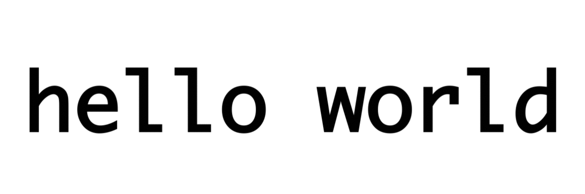

import Ling from './ling'

I have done quite a bit of [traveling](/travelogue) recently, visiting 18
countries in the past two years! When visiting a new country, its languages
immediately capture my interest. Each language is unique in the ways it uses
to convey information, but all of them share the common goal of providing
people with a medium to communicate.

I always get excited when encountering cognate words in a language. A language
that contains cognates means that it is similar to another language that
I have previously come across, so I don't have to begin learning phrases from
scratch and can make some educated guesses on words I don't know. By doing so,
I can appear a little less helpless when ordering food in a foreign country.

Consequently, the topic of language similarity has been on my mind for quite
some time now, so much so I enrolled in two linguistics classes last spring
to learn more about the subject.

### Introduction

What does it mean for two languages to be similar? Perhaps they have similar
grammar and syntax. Maybe, they sound alike. As mentioned before, it could be
that they share many cognates. Linguists have been asking these questions since
the late 18th century, when the field of historical linguistics had begun to
take shape.[^1] By analyzing historical records and language corpora, trained
linguists have classified languages and reconstructed their genealogies.


The infographic above shows the Indo-European family tree as reconstructed
by historical linguists. The family tree shows Spanish and Portuguese
adjacent to each other. The same goes with Hindi and Urdu, indicating
they have diverged fairly recently and are relatively similar to each other.
If you have studied a foreign language before, you may be able to spot other
connections as well. A branch on the tree indicates a subfamily and may also
indicate the existence of a proto-language. A proto-language refers to a
hypothesized common ancestor language, much like what you would see in
evolutionary biology.

I am not a trained linguist, but I want to find out if I can arrive at
similar conclusions without an extensive knowledge of historical linguistics
and human geography.

### Methods

Mutual intelligibility is one test that is useful in determining if two
languages are related. Spanish and Portuguese are said to be mutually
intelligible because speakers of both languages can understand each other
without much difficulty, even if they are said be speaking two different
languages. Mutual intelligibility doesn't always have to be symmetric
like with Spanish and Portuguese.[^2] The Scandinavian languages are a prime
example. Danish speakers can understand Norwegian and Swedish speakers, while
the reverse is not necessarily true. Norwegian and Swedish speakers generally
have a harder time understanding Danes than the reverse due to Danish's unique
phonetics.

For a more quantitative measure of similarity, lexicostatistics provides a
method to gauge lexical similarity between languages.[^3] Lexicostatistics
involves counting the number of cognate words between languages to determine
similarity. The more cognates two languages have in common, the more similar
they are.

The *Ethnologue* is an annual reference publication of all known languages and
corresponding statistics.[^4] To compute lexical similarity, the Ethnologue uses
the Swadesh List,[^5] a standardized list of 100 words containing fundamental
words across languages such as *I*, *you*, *one*, *two*, *man*, *woman*,
*hand*, etc. The similarity between any two languages is simply the percentage
of words that are cognates.

![Fig 2. Lexical similarity matrix of select languages from the Ethnologue.]
(matrix.png)

Using this method, the Ethnologue computed the lexical similarity coefficients
between various pairs of languages, arranged in the matrix seen in figure 2.[^6]
Among other things, Spanish and Portuguese have a very high similarity
coefficient (0.89), confirming our understanding of language families as
established in figure 1.

It is clear lexicostatistics produces meaningful results. However, it requires
specific knowledge of individual languages. Cognates may not always be
straightforward to identify without the a background in linguistics.
For example, it was not immediately obvious to me how the English word *two*
and the German *zwei* are related.

> The w in the English spelling used to be pronounced in Old English, as
it still is in some dialects, such as Scots [twO:] or [twe:], and there is
a regular correspondence of initial [t] in English with [ts] in German,
seen also in tide versus Zeit, or ten versus zehn.[^7]

### N-Gram Similarity

I read a paper[^8] in one of the courses I was taking last spring that
describes a simple method of measuring language similarity using n-grams.
The method does not require any prior knowledge of a language like
lexicostatistics does. My mind was blown the first time I read through the
paper. The methodology was so simple; I could not believe it worked, so
I quickly hacked up my own implementation. Sure enough, I was getting the
same results!

For those unfamiliar, an *n-gram* refers to a list of *n* sequential objects.
Theses objects could be characters, syllables, or even entire words. For
example, *he said* and *and then* are common word-level 2-grams in the English
language.

The first step of the process is to count the number of n-grams in a piece of
text in given language. To do this, I am going to take advantage of the
*Universal Declaration of Human Rights* (UDHR) parallel corpus. The UDHR is a
document published by the United Nations that has been translated into over
500 languages.

For now, let's pretend the English translation of the UDHR consists entirely of
the text *hello world*, and we want to count the number of character-level
4-grams in the text.


<figcaption class="gatsby-resp-image-figcaption">
Fig 3. Character-level 4-grams in the string "hello world".</figcaption>

Using figure 3 for reference, we start scanning the text 4 characters at a
time. For each unique 4-gram we keep track of its frequency.
In this example, we find 8 unique 4-grams, `hell`, `ello`, `llo `, `lo w`,
`o wo`, ` wor`, `worl`, and `orld`, each with a frequency of 1. Note that
spaces are included in this example.

The python implementation of this can be seen below.

```python
n = 4
text = 'hello world'
freq = {}
for i in range(len(text) - n + 1):
	ngram = text[i:i+n]
	if ngram in freq:
		freq[ngram] += 1
	else:
		freq[ngram] = 1
```

Using the UDHR translations, I repeated this process for over 30 languages.
The result is a collection of frequency tables of n-grams for 30+ different
languages. Each frequency table can be thought of as a vector where each
index is a unique n-gram and the value at that index is its frequency.

Calculating the similarity between two languages is as simple as taking the
normalized dot product between the two languages' corresponding vectors. The
resulting dot product will give a value between 0 and 1, representing the
similarity!

> Recall the dot product is the sum of products of corresponding entries in two
vectors. If two languages have an n-gram in common, the frequencies at that
entry will both be non-zero and produce a positive product, increasing the
dot product. If they do not, at least one of the frequencies will be 0,
so the resulting product at that n-gram will also be 0, and the total dot
product will not increase. In this way, the dot product can be used to measure
similarity. The vectors are also normalized to produce a value between 0 and 1.

I repeated this entire process for every pair of languages to produce
a similarity matrix similar to the one found in figure 2. After generating the
similarity matrix, I mapped each value to a distance (lower similarity
values correspond to greater distances). The result is a distance matrix!
The matrix now describes the distances between different languages. The
distance matrix also describes a complete, weighted graph. To visualize it,
I created a force-directed graph[^9] from the distance matrix using
[D3.js](https://d3js.org/).

<Ling />

I have to say I am pretty happy with the results! The force directed graph
does a good job at arranging languages with respect each other according to the
distance matrix. The Romance languages and the Germanic languages formed
visible clusters. The Austronesian languages (Malay, Indonesian, Javanese,
Filipino) have grouped together. Swahili and Kikongo also appear fairly close
in the graph because they are both Bantu languages.

### Discussion

This rudimentary method works without prior knowledge of languages
because it uses the n-gram as its base unit for analysis rather than individual
words. Also, I want to note that the UDHR is a relatively short piece of text,
so it's quite remarkable that this method could produce similar conclusions to
those shown in figure 1, despite using such small samples.

As for how this method works, it appears that the n-grams that languages
had common mostly came from short words like articles (*The feminine
form of the word "the" is the same in French, Spanish, and Italian.*) or
cognate words with similar spellings.

If you haven't already noticed, all the languages compared thus far use the
Latin alphabet in its written language. This is a current limitation of this
method. I have put a lot of thought into ways around these limitations, such
as transcribing languages into a common script before processing, but there
are many challenges. Transcribing in particular is a very messy task, and a
topic for another day.

### Future Work

When I get the time, I would like to try to add support for other scripts like
Cyrillic, Arabic, and Hangul to get around some of those limitations. Also,
it would be interesting to look for an analog of this method for computing
phonetic similarity between languages, as this method only considers the
written forms of languages.

This was a long post, so I congratulate on making it all the way to the end!
Thanks so much for reading! If you want to do some further reading, you can
check out the footnotes and the
[source code](https://github.com/csshen/cshen-site/blob/master/content/blog/linguistic-phylogenies/ling.py)
for this project.

[^1]: [Historical Linguistics / Wikipedia](https://en.wikipedia.org/wiki/Historical_linguistics)
[^2]: [North Germanic Languages, Mutual intelligibility / Wikipedia](https://en.wikipedia.org/wiki/North_Germanic_languages#Mutual_intelligibility)
[^3]: [Lexicostatistics / Wikipedia](https://en.wikipedia.org/wiki/Lexicostatistics)
[^4]: [Ethnologue](https://www.ethnologue.com/)
[^5]: [Swadesh List / Wikipedia](https://en.wikipedia.org/wiki/Swadesh_list)
[^6]: [Lexical Similarity / Wikipedia](https://en.wikipedia.org/wiki/Lexical_similarity)
[^7]: [A McMahon, R McMahon / Language classification by numbers p.34](http://ndl.ethernet.edu.et/bitstream/123456789/36887/1/5..pdf)
[^8]: [M. Damashek / Gauging Similarity with n-Grams: Language-Independent Categorization of Text](http://citeseerx.ist.psu.edu/viewdoc/download?doi=10.1.1.159.7010&rep=rep1&type=pdf)
[^9]: [Force-directed graph drawing / Wikipedia](https://en.wikipedia.org/wiki/Force-directed_graph_drawing)
