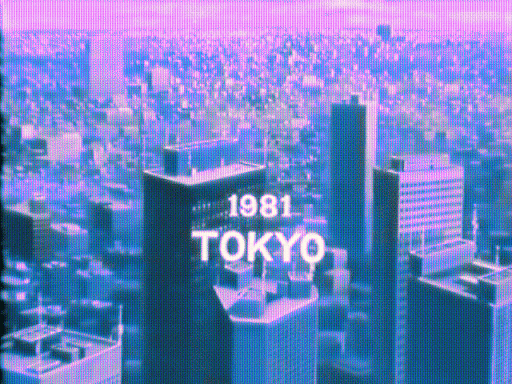

I have been feeling nostalgic lately. Social distancing is lonely, even more so
after moving to a new city, so I guess it can't be helped. One of the few
things I can't get off mind lately is the *vaporwave* meme. I have been
listening to [MACINTOSH PLUS 420](https://www.youtube.com/watch?v=aQkPcPqTq4M)
unironically and can't seem to stop.

*"What is vaporwave?"* you might ask. From wikipedia [^1]

> Vaporwave is a microgenre of electronic music, a visual art style, and an
Internet meme that emerged in the early 2010s. It is defined by its mimetic
embrace of Internet culture and its sampling of 1980s and 1990s styles such
as smooth jazz, elevator music, R&B, and lounge music, typically manipulating
tracks via chopped and screwed techniques and other effects.

Common features of the vaporwave visual ａｅｓｔｈｅｔｉｃ are described below.

> The visual aesthetic (often stylized as "ＡＥＳＴＨＥＴＩＣＳ", with fullwidth
characters) incorporates early Internet imagery, late 1990s web design, glitch
art, and cyberpunk tropes, as well as anime, Greco-Roman statues, and
3D-rendered objects.

A curious trait of the aesthetic is its common use of stylized Japanese
text. [^2] [^3] Why does vaporwave incorporate so much Japanese imagery? Memes?
Maybe. But beyond memes, there is a much deeper explanation that involves
the post WWII history of Japan.

Japan was devastated after WWII, and its prospects were bleak to say the
least. The Marshall Plan and a strong U.S. presence in the country post-war
helped Japan get back on its feet economically and kickstarted an unrivaled
period of economic growth. This era of history from post-war up until the early
1990s is referred to as the Japanese economic miracle.

Japan in the 80s was the culmination of the economic miracle and saw the
expansion of now familiar companies such as Sony, Panasonic, Nintendo,
and Toyota. Vaporwave was very much inspired by the
technology and consumerism of this era. At the time, Japan's economy was
second only to the United States by GDP, [^4] and there were fears in the
U.S. that Japan would surpass the U.S. and become the world's dominant
superpower. [^5] The following video explains 1980s Japan as it appears as the
setting of Netflix's *Earthquake Bird*.

<iframe
  width="560"
  height="315"
  src="https://www.youtube.com/embed/E3rtq7EdXwI"
  frameborder="0"
  allow="accelerometer; autoplay; encrypted-media; gyroscope; picture-in-picture"
  allowfullscreen>
</iframe>

All good things must come to an end, and the economic miracle came to a sharp
crash in 1991 when Japan's asset price bubble collapsed. The period of economic
stagnation that followed became known as the lost decade. [^6]

The term *vaporwave* is derived from *vaporware*, a term used to describe
a product, typically hardware or software, that is announced to the general
public but never released.

Vaporwave evokes nostalgia of a time when the party didn't stop — a time where
the Japanese economic miracle continued and a time when the dot com bubble
didn't come crashing down. Like vaporware, *vaporwave* envisions something that
never became a reality.

When I put on my headphones and set
[MACINTOSH PLUS 420](https://www.youtube.com/watch?v=aQkPcPqTq4M) on loop,
I can't help but imagine the future that never was.

**Demo**

Here is my attempt at creating【ａｅｓｔｈｅｔｉｃ】. The following animations
were created using [three.js](https://threejs.org/), a 3D graphics JavaScript
library built on top of WebGL.

[demos here]

I recommend checking out the following videos to learn more about how vaporwave
gook over the internet.  
[Vaporwave: Genre Redefined](https://www.youtube.com/watch?v=xJwqp0IByto)  
[How Vaporwave AESTHETICS took over the internet](https://www.youtube.com/watch?v=9LQNeLwVaK8)

[^1]: [Vaporwave | Wikipedia](https://en.wikipedia.org/wiki/Vaporwave)
[^2]: [Vaporwave | Know Your Meme](https://knowyourmeme.com/memes/cultures/vaporwave)
[^3]: [Aesthetic | Know Your Meme](https://knowyourmeme.com/memes/aesthetic)
[^4]: [Japanese Economic Miracle | Wikipedia](https://en.wikipedia.org/wiki/Japanese_economic_miracle)
[^5]: [TV Tropes | Japan Takes Over the World](https://tvtropes.org/pmwiki/pmwiki.php/Main/JapanTakesOverTheWorld)
[^6]: [Lost Decade (Japan)](https://en.wikipedia.org/wiki/Lost_Decade_(Japan))
[^7]: [Vaporware | Wikiepdia](https://en.wikipedia.org/wiki/Vaporware)
